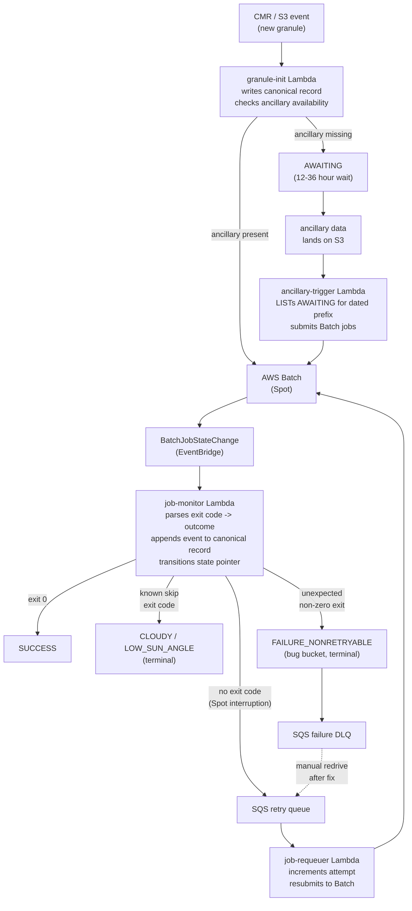
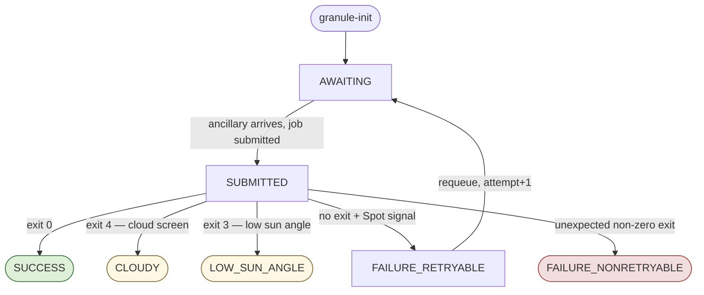

# HLS NextGen Orchestration: System Design

## Table of Contents

- [Background & Motivation](#background--motivation)
  - [Problems with the Current Architecture](#problems-with-the-current-architecture)
  - [Prototype Validation](#prototype-validation)
  - [Prototype Status](#prototype-status)
- [Target Architecture](#target-architecture)
  - [Core Design Principle](#core-design-principle)
  - [High-Level Components](#high-level-components)
- [S3 Log Schema Design](#s3-log-schema-design)
  - [Three-Object Model](#three-object-model)
  - [Output Granule ID Resolution](#output-granule-id-resolution)
  - [Why Two Objects](#why-two-objects)
  - [State Machine](#state-machine)
  - [Concurrency / Race Conditions](#concurrency--race-conditions)
  - [Key Recovery from Batch Events](#key-recovery-from-batch-events)
- [Component Design](#component-design)
  - [Lambda: granule-init](#lambda-granule-init)
  - [Lambda: ancillary-trigger](#lambda-ancillary-trigger)
  - [Landsat Two-Phase Workflow](#landsat-two-phase-workflow)
  - [Lambda: landsat-tile-trigger](#lambda-landsat-tile-trigger)
  - [Lambda: job-monitor](#lambda-job-monitor)
  - [Lambda: job-requeuer](#lambda-job-requeuer)
  - [SQS Queues](#sqs-queues)
  - [AWS Batch Configuration](#aws-batch-configuration)
  - [Analytics: Athena over S3 Inventory](#analytics-athena-over-s3-inventory)
- [Design Patterns Carried Forward](#design-patterns-carried-forward)
- [Open Questions & Tradeoffs](#open-questions--tradeoffs)
  - [S3 Key Schema: Two-Object vs Single-Object](#s3-key-schema-two-object-vs-single-object)
  - [Ancillary Data Dependency](#ancillary-data-dependency)
  - [Twin Granule Detection](#twin-granule-detection)
  - [Landsat Tile Readiness](#landsat-tile-readiness-expected-wrs-2-count)
  - [Job Splitting (Post-V1)](#job-splitting-post-v1)
  - [AWS Batch Job Timeout](#aws-batch-job-timeout)
  - [Operational Runbook](#operational-runbook)
- [Implementation Sequencing](#implementation-sequencing)
- [Appendix](#appendix)
  - [A. Observation Time in Granule IDs (V3 Consideration)](#a-observation-time-in-granule-ids-v3-consideration)

---

## Background & Motivation

The current HLS processing orchestration uses AWS Step Functions to orchestrate a single monolithic AWS Batch job per
granule. This architecture has several scaling and operational problems that this design addresses.

### Problems with the Current Architecture

**The RDS log database causes active data loss, not just observability gaps:**

- RDS timeouts during the Step Functions initialization step cause granules to be silently dropped — the job never gets
  submitted because the pre-job log write fails
- RDS timeouts during the post-job monitoring step cause processing outcomes to go unrecorded — a successfully completed
  job may appear as if it never ran, or a failure goes untracked and is never retried
- The database must be pruned to stay performant, which destroys the audit trail needed for historical reprocessing
  decisions and reconciliation with upstream providers (ESA, USGS) and downstream distributors (LP DAAC)
- Basic operational questions — what fraction of granules are rejected at cloud cover? what's the retry rate by failure
  mode? — cannot be answered empirically because the data has been pruned

**Step Functions polling causes rate limit issues at scale:**

- At 10-20k concurrent jobs, the Batch polling loop in Step Functions hits AWS API rate limits
- The Step Functions state machine is also the wrong abstraction for event-driven processing — it was designed for
  sequential job control, not for responding to asynchronous batch job events

**The monolithic job structure creates Spot market risk:**

- Each job runs all processing steps (fmask -> LaSRC -> post-processing -> upload) in a single Batch job
- LaSRC alone is ~50% of Sentinel-2 runtime, so every job has a long tail of Spot exposure
- A Spot interruption after LaSRC completes wastes the most expensive compute

**The twin granule case is underweighted:**

- Originally estimated at <1% of Sentinel-2 jobs, actual rate from log analysis is 8–10%
- The current architecture handles it within a single job; future splits need to account for it explicitly

### Prototype Validation

The `hls-vi-historical-orchestration` system validated the core event-driven S3-log pattern for historical backfill of
the HLS Vegetation Index product. That system processed ~30 million historic granules without ancillary data
dependencies (submitted from a static Parquet inventory) and proved:

- **S3 as immutable event log scales without pruning or performance degradation**
- **EventBridge Batch job state change events eliminate polling**
- **Layered retry strategy** (AWS Batch internal retries + SQS retry queue) handles Spot interruptions cleanly
- **Athena enables flexible reprocessing**: when bug fixes introduced unexpected failures that weren't auto-retried, all
  affected granules could be resubmitted via a single Athena query over the full log history; recent failures could
  alternatively be redriven directly from the DLQ without any manual job enumeration
- **Weekly progress reporting** was straightforward: Athena queries over the S3 log gave per-satellite and per-year
  success/failure breakdowns, providing a live view of progress as the backfill churned through the full granule archive
- **Athena over S3 Inventory gives a queryable audit trail at no operational cost**

This architecture is also well-suited to future historical backfills — for example, a potential HLS version 3 or an
upcoming temporal composite product would follow the same pattern: a static inventory drives job submission, the same
Lambda/SQS/EventBridge components handle outcomes, and the S3 log accumulates a full audit trail queryable via Athena.

The new HLS NextGen orchestration adapts this pattern for event-driven (not inventory-driven) processing with ancillary
data dependencies.

### Prototype Status

A further prototype, `hls-nextgen-orchestration`, has been built specifically with the HLS-VI experience in mind and
forms the foundation of this design. It implements:

- **`GranuleProcessingEvent`** data model with both `granule_id` (output HLS ID) and `source_granule_id` (upstream
  SAFE/scene ID), plus `attempt` and `debug_bucket`
- **`ProcessingState`** enum: `AWAITING`, `SUBMITTED`, `SUCCESS`, `FAILURE_RETRYABLE`, `FAILURE_NONRETRYABLE`
- **`granule_entry` Lambda** — triggered by S3 events on the input bucket; checks ancillary readiness at arrival time
  and either submits immediately (`SUBMITTED`) or records as waiting (`AWAITING`)
- **`job_monitor` Lambda** — EventBridge Batch state change consumer; parses outcome and routes to retry queue or DLQ
- **`job_requeuer` Lambda** — SQS consumer; increments attempt and resubmits
- **Full CDK stack** — Batch compute environment, job queue, SQS queues (entry, retry, DLQ), EventBridge rule, SNS->SQS
  subscription from input bucket
- **`moto`-based test suite** covering all three Lambda handlers

**What remains to build:**

- **`ancillary-trigger` Lambda** — the primary missing piece; fires when ancillary data lands and re-scans `AWAITING`
  granules for that date (see Component Design below)
- **`CLOUDY` and `LOW_SUN_ANGLE` terminal states** — currently collapsed into `FAILURE_NONRETRYABLE` in the prototype
- **Two-object S3 schema** — the prototype uses a single-object HIVE-partitioned schema; this design adopts the
  two-object model (see tradeoffs)
- **Landsat two-phase workflow** — the prototype is Sentinel-2 only; Landsat requires `landsat-ac` (per WRS-2 scene,
  fits existing state machine) + `landsat-tile` (mosaicking, new `landsat-tile-trigger` Lambda with event + schedule
  triggers and MGRS-WRS-2 lookup table)

---

## Target Architecture

### Core Design Principle

**S3 is the event store, log database, and coordination mechanism.** No RDS. State transitions are S3 object writes.
Scans are S3 LIST operations over partitioned prefixes. History is never pruned. Analytics run via Athena over S3
Inventory.

### High-Level Components



---

## S3 Log Schema Design

### Three-Object Model

Each granule attempt has up to three S3 representations with different purposes:

**1. Canonical record** — stable key, full event history, never deleted, Athena source

```
s3://BUCKET/records/{workflow}/{acquisition_date}/{source_granule_id}/{attempt}.json
```

Example:

```
records/sentinel/2024-01-15/S2A_MSIL1C_20240115T.../001.json
```

Content: append-only event log for this attempt. `output_granule_id` is known at submission time and written immediately
(see Output Granule ID Resolution below).

```json
{
  "source_granule_id": "S2A_MSIL1C_20240115T...",
  "output_granule_id": "HLS.S30.T10SEG.2024015T...",
  "workflow": "sentinel",
  "acquisition_date": "2024-01-15",
  "attempt": 1,
  "events": [
    { "state": "AWAITING", "ts": "2024-01-15T00:00:00Z" },
    { "state": "SUBMITTED", "ts": "2024-01-16T12:00:00Z", "batch_job_id": "abc-123" },
    { "state": "SUCCESS", "ts": "2024-01-16T13:10:00Z", "exit_code": 0 }
  ],
  "current_state": "SUCCESS"
}
```

**2. State pointer** — state-keyed prefix, minimal JSON body, write-new + delete-old on transition

```
s3://BUCKET/state/{state}/{workflow}/{acquisition_date}/{source_granule_id}/{attempt}
```

Example:

```
state/AWAITING/sentinel/2024-01-15/S2A_MSIL1C_.../001
state/SUBMITTED/sentinel/2024-01-15/S2A_MSIL1C_.../001
state/SUCCESS/sentinel/2024-01-15/S2A_MSIL1C_.../001
```

**3. Output index** — written for all terminal states, state in key prefix, empty body

```
s3://BUCKET/outputs/{state}/{workflow}/{acquisition_date}/{output_granule_id}
```

Example:

```
outputs/SUCCESS/sentinel/2024-01-15/HLS.S30.T10SEG.2024015T...
outputs/CLOUDY/sentinel/2024-01-15/HLS.S30.T10SEG.2024015T...
outputs/LOW_SUN_ANGLE/sentinel/2024-01-15/HLS.S30.T10SEG.2024015T...
outputs/SUCCESS/landsat-tile/2024-01-15/HLS.L30.T10SEG.2024015T...
```

Written by `job_monitor` at terminal state. `output_granule_id` is known at submission time (see Output Granule ID
Resolution below) and encoded in Batch env vars. State in the key prefix keeps all reconciliation queries as pure key
parsing with no body reads:

- `LIST outputs/SUCCESS/{workflow}/{date}/` -> products successfully produced (LP DAAC reconciliation)
- `LIST outputs/CLOUDY/{workflow}/{date}/` -> granules screened out by cloud cover
- `LIST outputs/` across all states -> full coverage picture for a date

### Output Granule ID Resolution

`output_granule_id` is computed in the orchestration layer at submission time — not inside the container:

- **Sentinel-2 single-granule**:
  - Derived at `granule-init` time from the source granule ID (`HLS.S30.{tile}.{yyyydoyThhmm}.v2.0`).
  - Fully deterministic; no container involvement needed.
- **Sentinel-2 twin granule**:
  - Some MGRS tiles are split across two ESA Level-1C granules from the same satellite pass due to ESA's pre-MGRS
    gridding. Both granules have the same sensing datetime but different processing timestamps.
  - The `granule-init` does an S3 LIST with a common prefix (stripping the last few chars of the processing timestamp
    catches both). - If 1 result: single job. - If 2 results: twin job.
  - Because both granules share the same sensing datetime, `output_granule_id` is derived the same way as single-granule
    — no "choosing which time wins." This is the existing `twin_granule.py` pattern from `hls-orchestration`.
- **`landsat-tile`**:
  - Derived at `landsat-tile-trigger` time from MGRS tile + acquisition date (`HLS.L30.{MGRS}.{yyyydoyThhmm}.v2.0`).
- **`landsat-ac`**:
  - Intermediate WRS-2 product.
  - The `output_granule_id` is the AC output scene ID, derivable from the input scene ID and output bucket convention.

Because `output_granule_id` is known before the job runs, it is encoded in the Batch job env vars at submission and
written to the canonical record immediately. The output index entry is written by `job_monitor` at terminal state for
all outcomes (see output index below), not only `SUCCESS`.

### Why Three Objects

| Need                                      | Canonical record                 | State pointer                                | Output index                            |
| ----------------------------------------- | -------------------------------- | -------------------------------------------- | --------------------------------------- |
| Scan "what's AWAITING for date D?"        | ✗ (state in body, not scannable) | ✓ `LIST state/AWAITING/sentinel/2024-01-15/` | ✗                                       |
| Full event history for Athena             | ✓ append-only events array       | ✗ (no history)                               | ✗                                       |
| Deterministic lookup by source granule ID | ✓ construct key directly         | ✓ construct key directly                     | ✗ (keyed by output_granule_id)          |
| Reconciliation by output granule ID       | ✗ (keyed by source_granule_id)   | ✗ (keyed by source_granule_id)               | ✓ `LIST outputs/SUCCESS/sentinel/date/` |
| All terminal outcomes by output granule   | ✗                                | ✗                                            | ✓ `LIST outputs/{state}/sentinel/date/` |
| Atomic state transitions                  | N/A (overwrite in place)         | ✗ (write + delete, not atomic)               | N/A (append-only per terminal state)    |

### State Machine



`RUNNING` is intentionally omitted — observing the transition from `SUBMITTED` to running is impractical (the job may
exit before we'd write it) and adds complexity without operational value.

Terminal states (`SUCCESS`, `CLOUDY`, `LOW_SUN_ANGLE`, `FAILURE_NONRETRYABLE`) — state pointer kept for operational
dashboards. Canonical record always kept. Separating `CLOUDY`/`LOW_SUN_ANGLE` from `FAILURE_NONRETRYABLE` keeps the "bug
bucket" clean: a spike in `FAILURE_NONRETRYABLE` means something broke, not just a cloudy day.

`FAILURE_RETRYABLE` creates a new attempt: pointer stays for history, new `AWAITING/.../{attempt+1}` pointer written for
the retry.

### Concurrency / Race Conditions

- Ancillary trigger Lambda may fire multiple times for the same dated prefix
- Two invocations may both see the same `available/` granule and submit duplicate jobs
- **Mitigation**: pipeline is idempotent; duplicate jobs produce identical outputs. S3 conditional write
  (`if-none-match`) on the `submitted/` pointer ensures only one invocation logs the submission. Sequence: submit job ->
  write `submitted/` pointer -> delete `available/` pointer.
- If `available/` pointer deletion fails, the next ancillary scan finds a stale pointer, submits an idempotent duplicate
  job, and the conditional write on `submitted/` fails (already exists) -> safely ignored.

### Key Recovery from Batch Events

All keying information is embedded in Batch job environment variables at submission time. The job-monitor Lambda
reconstructs the S3 key from the Batch job detail without scanning:

```python
ENV_KEYS = {
    "WORKFLOW", "ACQUISITION_DATE",
    "SOURCE_GRANULE_IDS", "OUTPUT_GRANULE_ID", "ATTEMPT",
}

def get_granule_event(job_detail: dict) -> GranuleProcessingEvent:
    """Reconstruct processing event from Batch job container environment."""
    env = {
        entry["name"]: entry["value"]
        for entry in job_detail["container"]["environment"]
        if entry["name"] in ENV_KEYS
    }
    return GranuleProcessingEvent(
        workflow=env["WORKFLOW"],
        acquisition_date=env["ACQUISITION_DATE"],
        source_granule_ids=env["SOURCE_GRANULE_IDS"].split(","),
        output_granule_id=env["OUTPUT_GRANULE_ID"],
        attempt=int(env["ATTEMPT"]),
    )


# S3 key constructors — no scanning, all derived from the event
def canonical_record_key(event: GranuleProcessingEvent, source_granule_id: str) -> str:
    return f"records/{event.workflow}/{event.acquisition_date}/{source_granule_id}/{event.attempt:03d}.json"

def state_pointer_key(event: GranuleProcessingEvent, source_granule_id: str, state: ProcessingState) -> str:
    return f"state/{state.name}/{event.workflow}/{event.acquisition_date}/{source_granule_id}/{event.attempt:03d}"

def output_index_key(event: GranuleProcessingEvent, state: ProcessingState) -> str:
    return f"outputs/{state.name}/{event.workflow}/{event.acquisition_date}/{event.output_granule_id}"
```

---

## Component Design

### Lambda: granule-init

**Prototype**: `src/granule_entry/handler.py` in `hls-nextgen-orchestration` (Sentinel-2 only)  
**Trigger**: S3 event on input granule bucket (SNS -> SQS)  
**Action**:

- Parse source granule ID from S3 object key; derive output granule ID and acquisition date
- Check ancillary data availability (S3 HEAD on dated aux prefix)
- If ancillary present: submit Batch job immediately, write `SUBMITTED` state pointer and canonical record
- If ancillary missing: write `AWAITING` state pointer and canonical record only

**Landsat `landsat-ac` path**: `granule-init` also handles WRS-2 scene arrivals — same ancillary check, same
`AWAITING`/`SUBMITTED` state machine, same Batch job submission. Key difference: `output_granule_id` for `landsat-ac` is
the atmospherically corrected WRS-2 tile (an intermediate product), not the final HLS MGRS tile. The HLS tile is
produced by `landsat-tile` after mosaicking; see Lambda: landsat-tile-trigger below.

### Lambda: ancillary-trigger

**Prototype**: not yet built — the primary new component  
**Trigger**: S3 PutObject event on ancillary data dated prefix  
**Action**:

- `LIST state/AWAITING/{workflow}/{dated_prefix}/` (bounded scan, ~20k max per date)
- For each `AWAITING` granule, verify all required ancillary files present for that date
- Submit AWS Batch job for each ready granule
- Write `state/SUBMITTED/...` pointer (conditional `if-none-match`)
- Delete `state/AWAITING/...` pointer
- Append `SUBMITTED` event to canonical record

**Concurrency**: Reserved concurrent executions = 1 — prevents parallel scans on the same dated prefix from racing.

### Landsat Two-Phase Workflow

Landsat processing is a map-reduce across two Batch job types:

1. **`landsat-ac`** — atmospheric correction per WRS-2 scene. One Batch job per scene. Follows the same
   `AWAITING -> SUBMITTED -> terminal` state machine as Sentinel-2; `granule-init` handles WRS-2 scene arrivals.

2. **`landsat-tile`** — mosaicking one or more `landsat-ac` outputs into a single HLS MGRS tile. The unit of work is
   **(MGRS tile, Landsat orbital path, acquisition date)**, not just (MGRS tile, date). A single MGRS tile can overlap
   multiple orbital paths (e.g., paths 018 and 019 both cover T10SEG); those are mosaicked as separate `landsat-tile`
   jobs. Within one path, 1–2 adjacent rows typically overlap the MGRS tile.

A lookup table (`HLS.L8S2overlap.txt`, space-separated: `pathrow MGRS ulx uly`) maps in both directions:

- WRS-2 path+row -> overlapping MGRS tiles (one-to-many)
- MGRS tile + path -> all row numbers from that path that overlap the tile

The lookup file is bundled with the Lambda (loaded at init time); same pattern should be used in the new design.

At `granule-init` time for a WRS-2 scene (`path`, `row`, `date`):

- Look up overlapping MGRS tiles from the lookup table
- Write one `AWAITING` canonical record + state pointer for the `landsat-ac` job
- Write one `AWAITING` canonical record + state pointer for each `(MGRS, path, date)` tiling unit, using a conditional
  write (`if-none-match`) so the first arriving row from a path creates the record idempotently

The `landsat-tile` job is submitted when:

- **Normal path**: all rows in the lookup table for `(MGRS, path)` have `landsat-ac` `SUCCESS` for this date -> submit
  with `PATHROW_LIST` = all rows from the lookup table
- **Timeout path (4-day fallback)**: at least one row has completed, the oldest completion is >4 days ago, and no
  `landsat-tile` has been submitted yet -> submit with `PATHROW_LIST` = only the rows that actually completed (partial
  composite — matches current `LandsatMGRSPartialsStepFunction` behavior)

**State key partitioning for multi-phase Landsat**: the `{satellite}` partition in state and record keys becomes
`{workflow}` to distinguish the two phases. `landsat-tile` keys include `{path}` since the tiling unit is
`(MGRS, path, date)`:

```
state/{state}/landsat-ac/{date}/{wrs2_scene_id}/{attempt}         ← per WRS-2 AC
state/{state}/landsat-tile/{date}/{mgrs_tile_id}/{path}/{attempt} ← per MGRS+path mosaic
records/landsat-ac/{date}/{wrs2_scene_id}/{attempt}.json
records/landsat-tile/{date}/{mgrs_tile_id}/{path}/{attempt}.json
```

Sentinel-2 uses `sentinel` as the `{workflow}` value (unchanged):

```
state/{state}/sentinel/{date}/{source_granule_id}/{attempt}
```

### Lambda: landsat-tile-trigger

**Prototype**: not yet built  
**Triggers**:

1. **Event** — SQS message from `job-monitor` after each `landsat-ac` `SUCCESS`. Message encodes the MGRS tile(s) and
   orbital path for the completed WRS-2 scene (derived from lookup table at `job-monitor` time or by
   `landsat-tile-trigger` itself).
2. **Schedule** — EventBridge Scheduler rule (e.g., every 4–8 hours) sweeps `state/AWAITING/landsat-tile/{date}/` for
   records whose oldest `landsat-ac` SUCCESS is >4 days ago.

**Action per (MGRS tile, orbital path, acquisition date)**:

- If a `SUBMITTED` or terminal state pointer already exists for this `(MGRS, path, date)`: skip — idempotent
- Look up all rows for `(MGRS, path)` from the lookup table
- `LIST state/SUCCESS/landsat-ac/{date}/` (or query canonical records) to find which rows have completed
- **Normal path**: if all lookup-table rows have `SUCCESS` -> submit `landsat-tile` with `PATHROW_LIST` = all rows
- **Timeout path**: if oldest row success timestamp >4 days and at least one row complete -> submit `landsat-tile` with
  `PATHROW_LIST` = completed rows only (partial mosaic)
- On submission: write `SUBMITTED` state pointer, delete `AWAITING` pointer, embed `(MGRS, path, all completed row IDs)`
  in Batch env vars
- If neither condition met: no-op

**`landsat-tile` canonical record key**: `records/landsat-tile/{date}/{mgrs_tile_id}/{path}/{attempt}.json`

- `source_granule_ids` = list of contributing WRS-2 scene IDs embedded in Batch env vars.
- `output_granule_id` = HLS MGRS tile ID (written via sidecar, same as Sentinel-2).

> [!NOTE]
>
> `MGRS_ULX` / `MGRS_ULY` (upper-left corner coordinates for the tiling job) also come from the lookup table and should
> be embedded in Batch env vars at submission time.

### Lambda: job-monitor

**Prototype**: `src/job_monitor/handler.py` in `hls-nextgen-orchestration`  
**Trigger**: EventBridge rule — `aws.batch` source, `Batch Job State Change`, status IN [SUCCEEDED, FAILED]  
**Action**:

- Reconstruct granule key from Batch job environment variables
- Determine outcome from exit code:
  - Exit 0 -> `SUCCESS`
  - Exit code = `SKIP_CLOUD` -> `CLOUDY`
  - Exit code = `SKIP_SUN` -> `LOW_SUN_ANGLE`
  - No exit code + `statusReason` starts with `"Host EC2"` -> `FAILURE_RETRYABLE` (Spot interruption)
  - Any other non-zero exit -> `FAILURE_NONRETRYABLE`
- Append outcome event to canonical record
- Write new state pointer, delete old state pointer
- Route: `FAILURE_RETRYABLE` on final Batch attempt -> SQS retry queue; `FAILURE_NONRETRYABLE` -> SQS DLQ

**Extension from prototype**: add `CLOUDY` and `LOW_SUN_ANGLE` exit code handling (currently collapsed into
`FAILURE_NONRETRYABLE`). Write output index entry for all terminal states (not only `SUCCESS`) using `OUTPUT_GRANULE_ID`
from Batch env vars — no sidecar read needed. For `landsat-ac` `SUCCESS`, also enqueue a readiness check message to
`landsat-tile-trigger` (encodes the MGRS tile(s) for the completed WRS-2 scene).

### Lambda: job-requeuer

**Prototype**: `src/job_requeuer/handler.py` in `hls-nextgen-orchestration`  
**Trigger**: SQS retry queue (batch size 100, 1-min window)  
**Action**:

- Parse granule event from SQS message
- Increment attempt counter
- Write new `state/AWAITING/.../{attempt+1}` pointer
- Append `AWAITING` event to canonical record (marking retry)
- Resubmit to AWS Batch

### SQS Queues

- **retry-queue**: `FAILURE_RETRYABLE` outcomes after Batch exhausts internal retries. Visibility timeout = 1 min.
- **failure-dlq**: `FAILURE_NONRETRYABLE` outcomes. Manual operator review; redriven via Athena query or DLQ console
  after deploying a fix.

### AWS Batch Configuration

**Compute environment**: Spot, compute-optimized instance classes (C4, C5, C5A, C6A, C6I), scale-to-zero. CDK construct
pattern established in `hls-nextgen-orchestration`.

**Per-satellite job definitions**: Landsat and Sentinel-2 have different CPU/memory requirements and container images.
Retry strategy: AWS Batch internal retries for Spot reclamation and image pull failures; all other failures exit
immediately (handled by job-monitor routing).

**Job timeout** (`attemptDurationSeconds`): see Open Questions.

### Analytics: Athena over S3 Inventory

Two-tier approach: S3 Inventory key parsing for routine operations, JSON record reads for deep dives.

**Primary: S3 Inventory -> Parquet (key parsing only, no JSON reads)**

Daily S3 Inventory on `state/` and `outputs/` prefixes exported as Parquet. All operationally useful information is
encoded in the key path and extractable via regex — no file content reads needed:

```
state/{STATE}/{workflow}/{date}/{granule_id}/{attempt}
outputs/{workflow}/{date}/{output_granule_id}
```

Covers the vast majority of analytics questions:

- Granule counts by state, workflow, date
- CLOUDY / LOW_SUN_ANGLE / FAILURE rates over time
- Pending retries (`AWAITING`, `SUBMITTED` counts)
- Successful output coverage by date (from `outputs/` inventory)
- Reconciliation: compare `outputs/` keys against LP DAAC catalog; compare `state/` keys against CMR

This pattern was validated in `hls-vi-historical-orchestration` — S3 Inventory Parquet + key parsing gave fast, cheap
progress reporting without any JSON reads.

**Secondary: Athena tables over `records/` JSON (deep dives)**

Three explicitly-defined tables — one per workflow prefix, schemas hand-written (no Glue crawler):

- `records_sentinel` -> `s3://BUCKET/records/sentinel/`
- `records_landsat_ac` -> `s3://BUCKET/records/landsat-ac/`
- `records_landsat_tile` -> `s3://BUCKET/records/landsat-tile/`

All three use **partition projection** over `date` — no `MSCK REPAIR TABLE`, no Glue catalog partition registration, new
partitions are queryable immediately as records land.

Use for:

- exit code distribution
- per-attempt event timelines
- `output_granule_id` lookups
- duration analysis
- reprocessing gap queries ("what was processed before algorithm version X?")

The typical workflow is to identify the target `(workflow, date, granule_id)` from a `state/` inventory query first,
then issue a fully partition-pruned `records/` read against that specific key — minimizing the number of JSON files
scanned to exactly the ones needed.

**Table definitions are stable across Phase 2 job-splitting changes.** New states (`FMASK_SUBMITTED`, `FMASK_SUCCESS`,
etc.) appear as new entries in the `events` array — array schema doesn't change. Per-step fields are reachable via
`unnest`; no `ALTER TABLE` needed when the state machine grows.

**Reconciliation queries** (key parsing over S3 Inventory Parquet — no JSON reads):

| Question                                                   | Source                                                                                    |
| ---------------------------------------------------------- | ----------------------------------------------------------------------------------------- |
| Downstream: did our products reach LP DAAC?                | `outputs/` inventory: parse `output_granule_id` from key, compare against LP DAAC catalog |
| Upstream: for granules ESA/USGS have, did we at least try? | `state/` inventory: parse `granule_id` from key, compare against CMR for that date        |

`state/` covers upstream because a state pointer is written at `granule-init` time — even permanently cloudy or
never-ancillary granules have a record. `outputs/` covers downstream because it is written only on `SUCCESS`.

---

## Design Patterns Carried Forward

HLS NextGen has significantly larger requirements than `hls-vi-historical-orchestration` or the
`hls-nextgen-orchestration` prototype, so direct code reuse is unlikely to be high-value. The design patterns, however,
are well-validated and should be carried forward:

| Pattern                                                   | Source                            | Notes                                         |
| --------------------------------------------------------- | --------------------------------- | --------------------------------------------- |
| S3 as immutable log + Athena over S3 Inventory            | `hls-vi-historical-orchestration` | Core principle; no RDS                        |
| EventBridge Batch state change rule                       | both prototypes                   | Eliminates polling                            |
| SQS dual-queue (retry + DLQ)                              | both prototypes                   | Clean separation of retryable vs bug failures |
| Reserved Lambda concurrency for single-writer             | `hls-vi-historical-orchestration` | Apply to `ancillary-trigger`                  |
| Spot interruption detection (no exit code + statusReason) | both prototypes                   | Carry forward exactly                         |
| Batch envvars for key recovery                            | `hls-nextgen-orchestration`       | All keying info in container env              |
| `source_granule_id` + `output_granule_id` data model      | `hls-nextgen-orchestration`       | Both IDs needed for traceability              |
| `AWAITING` / `SUBMITTED` / terminal state machine         | `hls-nextgen-orchestration`       | Extend with `CLOUDY`, `LOW_SUN_ANGLE`         |
| Parquet inventory + Athena for progress reporting         | `hls-vi-historical-orchestration` | Reuse query patterns, not code                |

Key architectural shift from both prototypes: `hls-vi` was inventory-driven (static Parquet list -> queue feeder
Lambda). `hls-nextgen-orchestration` is event-driven on granule arrival but has no mechanism for re-scanning `AWAITING`
granules when ancillary data arrives. This design closes that gap with the `ancillary-trigger` Lambda.

---

## Open Questions & Tradeoffs

### S3 Key Schema: Two-Object vs Single-Object

The recommended design is the two-object model described above (canonical record + state pointer). The
`hls-nextgen-orchestration` prototype uses a simpler single-object model as a point of comparison:

**Single-object (prototype)**: one JSON file per attempt, state-as-leading-key (HIVE partitioned). State transitions
write a new object + delete the old one. On `SUCCESS` after failures, previous failure logs are _migrated_ — copied to
the success prefix and deleted from the failure prefix — to keep the failure partition clean.

**Why two-object is preferred**:

- Log migration is complex, non-atomic, and unnecessary: the canonical record retains full history without any
  copy-and-delete operation
- State transitions only touch the tiny pointer object, not the full JSON record
- Athena always reads from a stable prefix (`records/`), not scattered across state prefixes

**Tradeoff**: the two-object model has one more object per granule attempt and two write paths per state transition. For
workloads where simplicity outweighs analytics needs, the single-object model is a viable alternative.

**Q: Pointer object body — empty or minimal JSON?** Minimal JSON (`{source_granule_id, output_granule_id, attempt}`) is
recommended — sufficient for scanning and useful for debugging without reading the canonical record.

**Q: How to handle the twin granule case in the key schema?** Twin jobs have two source granule IDs but one output
granule ID. Options:

- Composite source ID (sorted, joined): two same-satellite SAFE IDs differing only in processing timestamp, as the
  `source_granule_id` key component
- Use only the output granule ID as the key; store source ID list in the JSON body
- Separate records per source granule, linked by a shared job ID

**Resolved**: separate records per source granule, linked by `batch_job_id`. One canonical record + state pointer per
source granule; twin records share the same `batch_job_id`. This model is forward-compatible with the map/reduce split
in Phase 2 (where each source granule becomes its own Batch job).

### Ancillary Data Dependency

**Granule arrives before ancillary (the normal case, 12–36 hour wait):**  
`granule-init` writes `AWAITING` state. When ancillary data lands, `ancillary-trigger` scans
`state/AWAITING/{workflow}/{dated_prefix}/` and submits ready granules. The prototype already handles this path.

**Ancillary arrives before granule:**  
`ancillary-trigger` scans the `AWAITING` prefix for that date — finds nothing, exits. When the granule arrives later,
`granule-init` checks ancillary readiness at arrival time and submits immediately if present (already implemented in the
prototype's `check_aux_data()` pattern). No periodic re-scan needed; the check-on-arrival path covers this case.

### Twin Granule Detection

**Partially resolved** — the existing `hls-orchestration` system uses an S3 LIST pattern (`twin_granule.py`) that
carries forward directly.

**Detection at `granule-init` time**: strip the processing-datetime suffix from the SAFE ID to get a common prefix
shared by both ESA Level-1C granules from the same satellite pass. `LIST` the input bucket with that prefix:

- 1 result -> single-granule job; `output_granule_id` derived from that SAFE ID
- 2 results -> twin job; `output_granule_id` derived identically to single-granule (both granules share the same sensing
  datetime)

This means `granule-init` handles both cases: the first granule arrives and a single job is submitted; the second
granule arrives, the LIST now returns 2, and a twin job is submitted with both IDs.

**Known timing race**: the single-granule job (submitted first) may complete _after_ the twin job if the single job hits
a Spot interruption and retries. LP DAAC would then see a single-granule output overwrite the twin output. Mitigation:
when writing the HLS output, check if an output already exists for this granule ID; if it was produced by a twin job and
the current job is single-granule, exit successfully without overwriting. This becomes moot if the map-reduce job split
is implemented (Phase 2), since there would be no separate single-granule job for a tile that has a twin.

### Landsat Tile Readiness: "Expected" WRS-2 Count

**Resolved from current system (`hls-orchestration`).**

The current system uses **lookup-table-max within one orbital path**:

- For `(MGRS tile, path, date)`, the expected row set = all rows from the lookup table for that (MGRS, path) pair
- `landsat_pathrow_status.py` queries `landsat_ac_log` for `Status = SUCCEEDED` rows in that set and returns `True` iff
  the complete count matches the lookup table count
- The lookup table is authoritative; it contains only rows that geometrically overlap the MGRS tile

**Why this works even though Landsat has a ~16-day revisit cycle:**  
The revisit cycle means a given WRS-2 path/row doesn't acquire data every day. But in the current system, no
`landsat_mgrs_log` entry is created unless a WRS-2 scene actually _arrived_ — so the `landsat-tile-trigger` event is
only fired by real acquisitions. The lookup-table-max check then asks: "have all rows that geometrically intersect this
MGRS tile (within this path) been processed?" If the satellite didn't overpass a row that day, no scene arrives,
`landsat-ac` never runs for that row, and `landsat_pathrow_status` returns `False` indefinitely — which is why the 4-day
timeout and partial submission exist.

**Two-path submission in the new design:**

1. **Normal**: if `count(SUCCESS rows) == count(lookup-table rows for MGRS+path)` -> full mosaic, all rows
2. **Timeout**: if `oldest SUCCESS ts > 4 days` and `count(SUCCESS rows) > 0` -> partial mosaic, completed rows only

The pre-created `AWAITING` state pointer for each `(MGRS, path, date)` (written at `granule-init` time) gives the
scheduled sweep a scannable index: `LIST state/AWAITING/landsat-tile/{date}/` to find all pending tiling units.

### Job Splitting (Post-V1)

Not in scope for the initial event-driven orchestration rollout. After the S3 log infrastructure is established:

**Fmask split (Sentinel-2 single-granule only):**

- Adds a cheap "screening job" (Job 1: download + fmask + cloud/sun check) before the expensive job (Job 2: LaSRC +
  post-processing + upload)
- Benefit: cloudy/low-sun granules (~10–15% of Sentinel-2) run on a right-sized small instance and exit before LaSRC;
  `CLOUDY` / `LOW_SUN_ANGLE` become Job 1 terminal states, Job 2 never starts
- Adds intermediate states: `FMASK_SUBMITTED`, `FMASK_SUCCESS` (gate before Job 2)
- Requires: stable fmask output format on S3 as handoff between jobs (blocked by IO format tech debt)

**Twin granule map/reduce (Sentinel-2 twin case, ~8–10% of jobs):**

- Currently handled within one job via `MappedTask`/`MergeTask`
- Future: two parallel fmask jobs (one per granule), then one merge+LaSRC job if both pass
- Requires: job chaining logic in the orchestration layer (Step Functions Map state, or Lambda fan-out)
- Benefit: parallelizes per-granule work; early exits if either granule is cloudy

### AWS Batch Job Timeout

HLS jobs are configured with a `attemptDurationSeconds` set to 60 minutes. LaSRC uses a convergence approach to estimate
Aerosol Optical Thickness, and for some very cloudy granules this estimation never converges or can take a very long
time to converge. These jobs timeout and we handle them as unexpected failures that we retry.

With this proposed orchestration, timed-out jobs should be detected by job-monitor (no exit code, non-Spot status
reason) and routed to DLQ for investigation.

### Operational Runbook

What does an operator do with a non-retryable failure in the DLQ? The HLS-VI historical orchestration system had several
scripts to retry granules from the DLQ or from the logging database (S3 + Athena). The new system should have a script
or Lambda for common redrive patterns (e.g., "reprocess all `failed_nonretryable` granules from date range X after
deploying fix Y").

---

## Implementation Sequencing

**Phase 0: Shadow observability (no changes to existing system)**

Deploy `job-monitor` as a read-only shadow observer alongside the existing Step Functions orchestration. Job submission,
ancillary checking, and retry logic remain entirely in the existing system.

- `job-monitor` Lambda with EventBridge Batch state change trigger (same as final design)
- Writes canonical record + terminal state pointer for every completed Batch job
- Reconstructs lifecycle from Batch job detail: `SUBMITTED` event at `job.createdAt`, terminal event at `job.stoppedAt`
  — `AWAITING` is omitted (no signal available without `granule-init`)
- Records marked `"shadow": true` to distinguish from full-lifecycle records in Athena queries
- `output_granule_id`: derivable from existing Batch env vars for all workflows — single-granule Sentinel-2 from
  `GRANULE` (SAFE ID), twins from `GRANULE` (comma-separated SAFE IDs, same `twin_granule.py` derivation rule),
  `landsat-tile` from `MGRS` + `DATE`
- Define Athena/Glue table over `records/` prefix once a handful of records land — one-time table definition, then
  immediately queryable for exit code distribution, CLOUDY/LOW_SUN_ANGLE separation, Spot interruption rate, and retry
  convergence against real production data
- Monitoring Step Function state changes for `AWAITING` timestamps is explicitly out of scope — the correlation
  complexity is not worth one timestamp that disappears when `granule-init` is built

**Phase 1: Event-driven orchestration (this work)**

- Extend `hls-nextgen-orchestration` prototype: add `CLOUDY`/`LOW_SUN_ANGLE` states, two-object S3 schema
- Build `ancillary-trigger` Lambda (primary missing piece for Sentinel-2)
- Resolve twin granule key schema question
- Athena database over `records/` prefix
- Retire Step Functions polling + RDS log DB
- Landsat two-phase workflow: extend `granule-init` for WRS-2 arrivals (`landsat-ac` path), build `landsat-tile-trigger`
  (event + schedule modes), resolve WRS-2 completeness definition

**Phase 2: Job splitting (after Phase 1 is stable)**

- Resolve IO format tech debt (reduce format conversions, make inputs/outputs explicit)
- Implement fmask split for Sentinel-2 single-granule
- Evaluate twin granule map/reduce based on empirical data from Phase 1 Athena logs

**Phase 3: Historical reconciliation**

- Use Phase 1 Athena infrastructure to answer: what do we have? what are we missing? what needs reprocessing?
- Drive reprocessing campaigns from S3 inventory queries rather than manual DB queries

---

## Appendix

### A. Observation Time in Granule IDs (V3 Consideration)

HLS v2 granule IDs embed the observation _time_ as well as the date:

```
HLS.S30.T10SEG.2024015T160901.v2.0
                       ^^^^^^ HHMMSS
```

This creates friction in several places in the orchestration:

- **Twin job race**: twin granules are two ESA Level-1C granules from the same satellite pass covering different halves
  of the same MGRS tile. They share the same sensing datetime, so both the single-granule job (submitted on first
  granule arrival) and the twin job (submitted on second granule arrival) produce the _same_ `output_granule_id`. A
  single-granule job that retries after Spot interruption may overwrite the superior twin output; the container must
  conditionally skip the write if a twin-produced output already exists. A date-only ID would not eliminate this race —
  but it does make the shared-ID invariant explicit by construction, removing any ambiguity about which sensing time the
  ID encodes.
- **Reconciliation**: "did we produce output for tile T on date D?" cannot be answered by key construction alone. The
  time component is opaque without a lookup — you must scan by prefix or consult a secondary index.
- **Output index**: `outputs/SUCCESS/sentinel/2024-01-15/HLS.S30.T10SEG.2024015T160901.v2.0` — the time suffix is noise
  for any query other than an exact-key lookup.

A date-only ID scheme (`HLS.S30.T10SEG.20240115.v3.0`) would directly fix the reconciliation and output index problems,
and would make the twin race a true idempotent overwrite by construction rather than relying on the coincidence that
twins share a sensing datetime. The observation datetime doesn't need to be discarded — it belongs in product metadata
(STAC `datetime` field, CMR temporal coverage) where it's queryable without polluting the primary key. Not actionable
for v2 — the product specification is fixed — but worth tracking as a v3 motivation.
