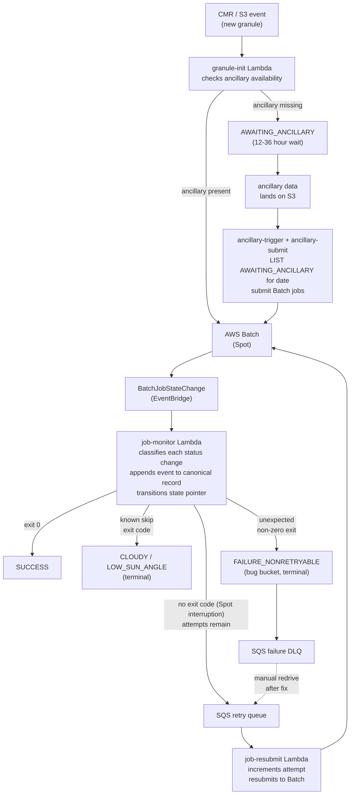
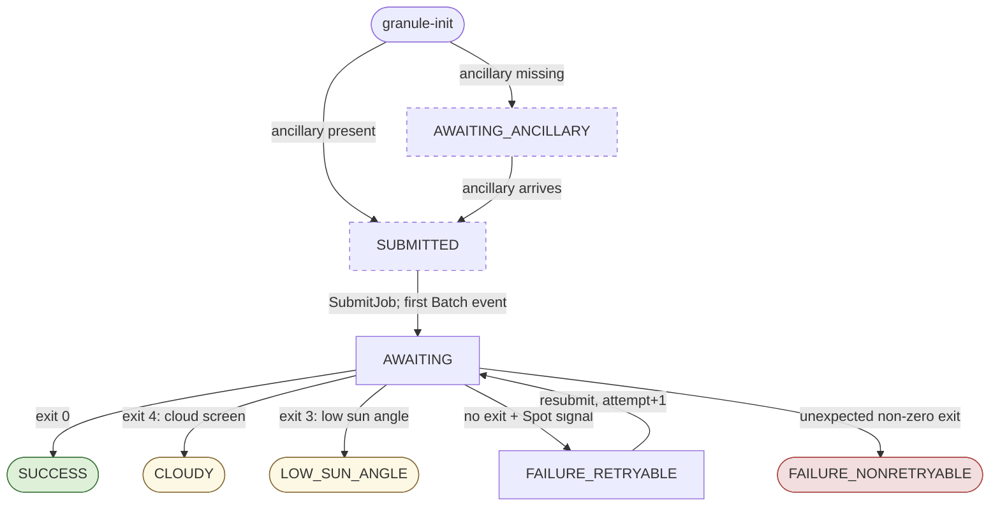

# HLS NextGen Orchestration: System Design

## Table of Contents

- [Background & Motivation](#background--motivation)
  - [Problems with the Current Architecture](#problems-with-the-current-architecture)
  - [Prototype Validation](#prototype-validation)
  - [Implementation Status](#implementation-status)
- [Target Architecture](#target-architecture)
  - [Core Design Principle](#core-design-principle)
  - [High-Level Components](#high-level-components)
  - [Job Monitoring Library](#job-monitoring-library)
- [S3 Log Schema Design](#s3-log-schema-design)
  - [Three-Object Model](#three-object-model)
  - [Output Granule ID Resolution](#output-granule-id-resolution)
  - [Why Three Objects](#why-three-objects)
  - [State Machine](#state-machine)
  - [Concurrency / Race Conditions](#concurrency--race-conditions)
  - [Key Recovery from Batch Events](#key-recovery-from-batch-events)
- [Component Design](#component-design)
  - [Lambda: granule-init](#lambda-granule-init)
  - [Lambda: ancillary-trigger](#lambda-ancillary-trigger)
  - [Lambda: ancillary-submit](#lambda-ancillary-submit)
  - [Landsat Two-Phase Workflow](#landsat-two-phase-workflow)
  - [Lambda: landsat-tile-trigger](#lambda-landsat-tile-trigger)
  - [Lambda: job-monitor](#lambda-job-monitor)
  - [Lambda: job-resubmit](#lambda-job-resubmit)
  - [SQS Queues](#sqs-queues)
  - [AWS Batch Configuration](#aws-batch-configuration)
  - [Analytics: Athena over S3 Inventory](#analytics-athena-over-s3-inventory)
- [Design Patterns Carried Forward](#design-patterns-carried-forward)
- [Open Questions & Tradeoffs](#open-questions--tradeoffs)
  - [S3 Key Schema: Two-Object vs Single-Object](#s3-key-schema-two-object-vs-single-object)
  - [Ancillary Data Dependency](#ancillary-data-dependency)
  - [Twin Granule Detection](#twin-granule-detection)
  - [Landsat Tile Readiness](#landsat-tile-readiness-expected-wrs-2-count)
  - [Job Splitting (Post-V1)](#job-splitting-post-v1)
  - [AWS Batch Job Timeout](#aws-batch-job-timeout)
  - [Operational Runbook](#operational-runbook)
- [Implementation Sequencing](#implementation-sequencing)
- [Appendix](#appendix)
  - [A. Observation Time in Granule IDs (V3 Consideration)](#a-observation-time-in-granule-ids-v3-consideration)

---

## Background & Motivation

The current HLS processing orchestration uses AWS Step Functions to orchestrate a single monolithic AWS Batch job per
granule. This architecture has several scaling and operational problems that this design addresses.

### Problems with the Current Architecture

**The RDS log database causes active data loss, not just observability gaps:**

- RDS timeouts during the Step Functions initialization step cause granules to be silently dropped — the job never gets
  submitted because the pre-job log write fails
- RDS timeouts during the post-job monitoring step cause processing outcomes to go unrecorded — a successfully completed
  job may appear as if it never ran, or a failure goes untracked and is never retried
- The database must be pruned to stay performant, which destroys the audit trail needed for historical reprocessing
  decisions and reconciliation with upstream providers (ESA, USGS) and downstream distributors (LP DAAC)
- Basic operational questions — what fraction of granules are rejected at cloud cover? what's the retry rate by failure
  mode? — cannot be answered empirically because the data has been pruned

**Step Functions polling causes rate limit issues at scale:**

- At 10-20k concurrent jobs, the Batch polling loop in Step Functions hits AWS API rate limits
- The Step Functions state machine is also the wrong abstraction for event-driven processing — it was designed for
  sequential job control, not for responding to asynchronous batch job events

**The monolithic job structure creates Spot market risk:**

- Each job runs all processing steps (fmask -> LaSRC -> post-processing -> upload) in a single Batch job
- LaSRC alone is ~50% of Sentinel-2 runtime, so every job has a long tail of Spot exposure
- A Spot interruption after LaSRC completes wastes the most expensive compute

**The twin granule case is underweighted:**

- Originally estimated at <1% of Sentinel-2 jobs, actual rate from log analysis is 8–10%
- The current architecture handles it within a single job; future splits need to account for it explicitly

### Prototype Validation

The `hls-vi-historical-orchestration` system validated the core event-driven S3-log pattern for historical backfill of
the HLS Vegetation Index product. That system processed ~30 million historic granules without ancillary data
dependencies (submitted from a static Parquet inventory) and proved:

- **S3 as immutable event log scales without pruning or performance degradation**
- **EventBridge Batch job state change events eliminate polling**
- **Layered retry strategy** (AWS Batch internal retries + SQS retry queue) handles Spot interruptions cleanly
- **Athena enables flexible reprocessing**: when bug fixes introduced unexpected failures that weren't auto-retried, all
  affected granules could be resubmitted via a single Athena query over the full log history; recent failures could
  alternatively be redriven directly from the DLQ without any manual job enumeration
- **Weekly progress reporting** was straightforward: Athena queries over the S3 log gave per-satellite and per-year
  success/failure breakdowns, providing a live view of progress as the backfill churned through the full granule archive
- **Athena over S3 Inventory gives a queryable audit trail at no operational cost**

This architecture is also well-suited to future historical backfills — for example, a potential HLS version 3 or an
upcoming temporal composite product would follow the same pattern: a static inventory drives job submission, the same
Lambda/SQS/EventBridge components handle outcomes, and the S3 log accumulates a full audit trail queryable via Athena.

The new HLS NextGen orchestration adapts this pattern for event-driven (not inventory-driven) processing with ancillary
data dependencies.

### Implementation Status

`hls-nextgen-orchestration` implements the Sentinel-2 workflow of this design, and shadows the existing system's
Sentinel-2 and Landsat jobs (see Implementation Sequencing). Job tracking, retries, and the Athena tables come from
[batch-event-job-monitor](https://github.com/NASA-IMPACT/batch-event-job-monitor) (see Job Monitoring Library below);
this repository holds the HLS-specific parts:

- **`common.jobs`** -- the job types (`sentinel`, plus the `phase0-*` types shadowing the existing system), their
  exit-code outcomes (`CLOUDY`, `LOW_SUN_ANGLE`), the submitter states (`AWAITING_ANCILLARY`, `SUBMITTED`), and the
  container environment every submission sets
- **`granule_init` Lambda** -- triggered by S3 events on the input bucket; detects twin granules, checks ancillary
  readiness at arrival time, and either submits immediately or records the granule as `AWAITING_ANCILLARY`
- **`ancillary_trigger` / `ancillary_submit` Lambdas** -- fire when ancillary data lands; enqueue and submit the
  granules waiting on it
- **`job_monitor` Lambda** -- the library's monitor, with a resolver that identifies the existing system's jobs
- **`job_resubmit` Lambda** -- resubmits retryable failures as the next attempt
- **CDK stack** -- Batch compute environment and job queue, the library's monitoring constructs, the S3 -> SQS triggers,
  and the Athena tables
- **`moto`-based test suite** covering every Lambda handler

**What remains to build:**

- **Landsat two-phase workflow** -- the stack submits Sentinel-2 jobs only; Landsat requires `landsat-ac` (per WRS-2
  scene, fits the existing state machine) + `landsat-tile` (mosaicking, new `landsat-tile-trigger` Lambda with event +
  schedule triggers and MGRS-WRS-2 lookup table)

---

## Target Architecture

### Core Design Principle

**S3 is the event store, log database, and coordination mechanism.** No RDS. State transitions are S3 object writes.
Scans are S3 LIST operations over partitioned prefixes. History is never pruned. Analytics run via Athena over S3
Inventory.

### High-Level Components


```mermaid
flowchart TD
    CMR["CMR / S3 event<br>(new granule)"]
    INIT["granule-init Lambda<br>checks ancillary availability"]
    WAIT["AWAITING_ANCILLARY<br>(12-36 hour wait)"]
    ANC["ancillary data<br>lands on S3"]
    TRIG["ancillary-trigger + ancillary-submit<br>LIST AWAITING_ANCILLARY for date<br>submit Batch jobs"]
    BATCH["AWS Batch<br>(Spot)"]
    EB["BatchJobStateChange<br>(EventBridge)"]
    MON["job-monitor Lambda<br>classifies each status change<br>appends event to canonical record<br>transitions state pointer"]
    SQS["SQS retry queue"]
    DLQ["SQS failure DLQ"]
    REQUEUE["job-resubmit Lambda<br>increments attempt<br>resubmits to Batch"]

    TERM_OK["SUCCESS"]
    TERM_SKIP["CLOUDY / LOW_SUN_ANGLE<br>(terminal)"]
    TERM_FAIL["FAILURE_NONRETRYABLE<br>(bug bucket, terminal)"]

    CMR --> INIT
    INIT -->|"ancillary missing"| WAIT
    INIT -->|"ancillary present"| BATCH
    WAIT --> ANC --> TRIG --> BATCH
    BATCH --> EB --> MON

    MON -->|"exit 0"| TERM_OK
    MON -->|"known skip<br>exit code"| TERM_SKIP
    MON -->|"unexpected<br>non-zero exit"| TERM_FAIL
    MON -->|"no exit code (Spot interruption)<br>attempts remain"| SQS
    TERM_FAIL --> DLQ
    DLQ -.->|"manual redrive<br>after fix"| SQS
    SQS --> REQUEUE --> BATCH
```

### Job Monitoring Library

The S3 log, monitor, and retry machinery is shared with other projects (the HLS monthly composites, and the
`hls-vi-historical-orchestration` system it was extracted from) as
[batch-event-job-monitor](https://github.com/NASA-IMPACT/batch-event-job-monitor) (BEJM). In BEJM's terms:

| This design                       | BEJM                                                                        |
| --------------------------------- | --------------------------------------------------------------------------- |
| workflow (`sentinel`, ...)        | `job_type`                                                                  |
| `acquisition_date`                | the one partition field                                                     |
| source granule IDs                | `input_entity_ids` (one canonical record + state pointer each)              |
| output granule ID                 | `output_entity_id`                                                          |
| `CLOUDY` / `LOW_SUN_ANGLE`        | `ExitCodeOutcomes` for exit codes 4 / 3, not dead-lettered                  |
| `AWAITING_ANCILLARY`, `SUBMITTED` | submitter states: written by this repo's Lambdas, cleared by the monitor   |

Every job this system submits carries BEJM's `bejm_*` Batch parameters, from which the monitor reconstructs its
identity. Every monitoring object is written under one key prefix in the processing bucket (`PROCESSING_KEY_PREFIX`,
`monitoring/` by default).

---

## S3 Log Schema Design

### Three-Object Model

Each source granule attempt has up to three S3 representations with different purposes. All keys sit under the
processing bucket's key prefix (`monitoring/` below).

**1. Canonical record** -- stable key, full event history, never deleted, Athena source

```
s3://BUCKET/monitoring/records/job_type={job_type}/acquisition_date={acquisition_date}/input_entity_id={source_granule_id}/{attempt:03d}.json
```

Example:

```
monitoring/records/job_type=sentinel/acquisition_date=2024-01-15/input_entity_id=S2A_MSIL1C_20240115T.../001.json
```

Content: append-only log of the Batch job state changes for this attempt, each at the EventBridge event's time.
`output_entity_id` is known at submission time (see Output Granule ID Resolution below).

```json
{
  "input_entity_id": "S2A_MSIL1C_20240115T...",
  "output_entity_id": "HLS.S30.T10SEG.2024015T...",
  "job_type": "sentinel",
  "partition_fields": { "acquisition_date": "2024-01-15" },
  "attempt": 1,
  "batch_job_id": "abc-123",
  "events": [
    { "state": "AWAITING", "timestamp": "2024-01-16T12:00:05+00:00", "batch_job_id": "abc-123" },
    { "state": "SUCCESS", "timestamp": "2024-01-16T13:10:00+00:00", "batch_job_id": "abc-123", "exit_code": 0 }
  ],
  "current_state": "SUCCESS",
  "log_stream_name": "sentinel-ac/default/0123456789abcdef",
  "created_at": "2024-01-16T12:00:00+00:00",
  "started_at": "2024-01-16T12:04:10+00:00",
  "stopped_at": "2024-01-16T13:10:00+00:00"
}
```

The canonical record starts at the job's first Batch event, so the wait for ancillary data before submission is visible
only through the `AWAITING_ANCILLARY` state pointer while it lasts.

**2. State pointer** -- state-keyed prefix, minimal JSON body, write-new + delete-old on transition

```
s3://BUCKET/monitoring/state/state={state}/job_type={job_type}/acquisition_date={acquisition_date}/input_entity_id={source_granule_id}/{attempt:03d}
```

Example:

```
monitoring/state/state=AWAITING_ANCILLARY/job_type=sentinel/acquisition_date=2024-01-15/input_entity_id=S2A_MSIL1C_.../001
monitoring/state/state=AWAITING/job_type=sentinel/acquisition_date=2024-01-15/input_entity_id=S2A_MSIL1C_.../001
monitoring/state/state=SUCCESS/job_type=sentinel/acquisition_date=2024-01-15/input_entity_id=S2A_MSIL1C_.../001
```

**3. Output index** -- written for all terminal states, state in key prefix, empty body

```
s3://BUCKET/monitoring/outputs/state={state}/job_type={job_type}/acquisition_date={acquisition_date}/{output_granule_id}
```

Example:

```
monitoring/outputs/state=SUCCESS/job_type=sentinel/acquisition_date=2024-01-15/HLS.S30.T10SEG.2024015T...
monitoring/outputs/state=CLOUDY/job_type=sentinel/acquisition_date=2024-01-15/HLS.S30.T10SEG.2024015T...
monitoring/outputs/state=LOW_SUN_ANGLE/job_type=sentinel/acquisition_date=2024-01-15/HLS.S30.T10SEG.2024015T...
```

Written by the job monitor at terminal state, once per job. `output_granule_id` is known at submission time (see Output
Granule ID Resolution below) and carried in the job's `bejm_output_entity_id` parameter. State in the key prefix keeps
all reconciliation queries as pure key parsing with no body reads:

- `LIST outputs/state=SUCCESS/job_type={job_type}/acquisition_date={date}/` -> products successfully produced (LP DAAC
  reconciliation)
- `LIST outputs/state=CLOUDY/job_type={job_type}/acquisition_date={date}/` -> granules screened out by cloud cover
- `LIST outputs/` across all states -> full coverage picture for a date

### Output Granule ID Resolution

`output_granule_id` is computed in the orchestration layer at submission time — not inside the container:

- **Sentinel-2 single-granule**:
  - Derived at `granule-init` time from the source granule ID (`HLS.S30.{tile}.{yyyydoyThhmm}.v2.0`).
  - Fully deterministic; no container involvement needed.
- **Sentinel-2 twin granule**:
  - Some MGRS tiles are split across two ESA Level-1C granules from the same satellite pass due to ESA's pre-MGRS
    gridding. Both granules have the same sensing datetime but different processing timestamps.
  - The `granule-init` does an S3 LIST with a common prefix (stripping the last few chars of the processing timestamp
    catches both). - If 1 result: single job. - If 2 results: twin job.
  - Because both granules share the same sensing datetime, `output_granule_id` is derived the same way as single-granule
    — no "choosing which time wins." This is the existing `twin_granule.py` pattern from `hls-orchestration`.
- **`landsat-tile`**:
  - Derived at `landsat-tile-trigger` time from MGRS tile + acquisition date (`HLS.L30.{MGRS}.{yyyydoyThhmm}.v2.0`).
- **`landsat-ac`**:
  - Intermediate WRS-2 product.
  - The `output_granule_id` is the AC output scene ID, derivable from the input scene ID and output bucket convention.

Because `output_granule_id` is known before the job runs, it is set on the Batch job at submission (as the
`bejm_output_entity_id` parameter, and the `OUTPUT_GRANULE_ID` container environment variable) and written to the
canonical record from the job's first event. The output index entry is written by the job monitor at terminal state for
all outcomes, not only `SUCCESS`.

### Why Three Objects

| Need                                      | Canonical record                 | State pointer                                         | Output index                                        |
| ----------------------------------------- | -------------------------------- | ----------------------------------------------------- | --------------------------------------------------- |
| Scan "what's waiting for date D?"         | ✗ (state in body, not scannable) | ✓ `LIST state/state=AWAITING_ANCILLARY/.../{date}/`   | ✗                                                   |
| Full event history for Athena             | ✓ append-only events array       | ✗ (no history)                                        | ✗                                                   |
| Deterministic lookup by source granule ID | ✓ construct key directly         | ✓ construct key directly                              | ✗ (keyed by output_granule_id)                      |
| Reconciliation by output granule ID       | ✗ (keyed by source_granule_id)   | ✗ (keyed by source_granule_id)                        | ✓ `LIST outputs/state=SUCCESS/.../{date}/`          |
| All terminal outcomes by output granule   | ✗                                | ✗                                                     | ✓ `LIST outputs/state={state}/.../{date}/`          |
| Atomic state transitions                  | N/A (overwrite in place)         | ✗ (write + delete, not atomic)                        | N/A (append-only per terminal state)                |

### State Machine


```mermaid
flowchart TD
    START([granule-init]) -->|"ancillary missing"| WAIT[AWAITING_ANCILLARY]
    START -->|"ancillary present"| CLAIM[SUBMITTED]
    WAIT -->|"ancillary arrives"| CLAIM
    CLAIM -->|"SubmitJob; first Batch event"| AWAIT[AWAITING]
    AWAIT -->|exit 0| OK([SUCCESS])
    AWAIT -->|"exit 4: cloud screen"| CLOUD([CLOUDY])
    AWAIT -->|"exit 3: low sun angle"| SUN([LOW_SUN_ANGLE])
    AWAIT -->|no exit + Spot signal| RETRY[FAILURE_RETRYABLE]
    AWAIT -->|unexpected non-zero exit| FAIL([FAILURE_NONRETRYABLE])
    RETRY -->|"resubmit, attempt+1"| AWAIT

    classDef terminal fill:#dff0d8,stroke:#3c763d
    classDef skip fill:#fcf8e3,stroke:#8a6d3b
    classDef bugbucket fill:#f2dede,stroke:#a94442
    classDef submitter stroke-dasharray: 5 5
    class OK terminal
    class CLOUD,SUN skip
    class FAIL bugbucket
    class WAIT,CLAIM submitter
```

The states have two owners:

- **Submitter states** (dashed) -- `AWAITING_ANCILLARY` and `SUBMITTED` are written by this repository's Lambdas before
  a job is in Batch. `SUBMITTED` is a claim, written just before calling SubmitJob. The monitor deletes both for an
  attempt on every Batch event for that attempt, so neither outlives the job's first event.
- **Monitor states** -- everything after submission, recorded by the job monitor from Batch job state change events.
  `AWAITING` covers a job in Batch (`PENDING`, `RUNNABLE`, `STARTING`, `RUNNING`); a job's queue and run times are in
  its canonical record (`created_at`, `started_at`, `stopped_at`).

Terminal states (`SUCCESS`, `CLOUDY`, `LOW_SUN_ANGLE`, `FAILURE_NONRETRYABLE`) -- state pointer kept for operational
dashboards. Canonical record always kept. Separating `CLOUDY`/`LOW_SUN_ANGLE` from `FAILURE_NONRETRYABLE` keeps the "bug
bucket" clean: a spike in `FAILURE_NONRETRYABLE` means something broke, not just a cloudy day.

`FAILURE_RETRYABLE` creates a new attempt: the job is resubmitted with `attempt + 1`, whose first event retires the
previous attempt's pointer. A retryable failure on the last of `JOB_RETRY_MAX_ATTEMPTS` attempts is terminal and goes to
the failure DLQ.

### Concurrency / Race Conditions

- The ancillary trigger may fire multiple times for the same date, and S3 may deliver a granule's arrival event more
  than once
- **Mitigation**: every submission first claims each of the job's source granules with a conditional write
  (`if-none-match`) of its `SUBMITTED` pointer. An invocation that loses a claim releases any claims it made and skips
  the job. Sequence: claim (`SUBMITTED`) -> SubmitJob -> delete `AWAITING_ANCILLARY`. A failed SubmitJob releases the
  claims, leaving the granules for a later attempt.
- If deleting `AWAITING_ANCILLARY` fails, the monitor deletes it on the job's first Batch event.
- EventBridge does not guarantee delivery order. The monitor appends every event to the canonical record, but never
  moves a state pointer backwards or resurrects an attempt a newer one has superseded.

### Key Recovery from Batch Events

All keying information is set on the Batch job at submission, as BEJM's `bejm_*` parameters
(`JobGroup.to_batch_parameters()`), which AWS Batch echoes back in every job state change event. The job monitor
reconstructs every S3 key from the event without scanning:

| Parameter               | Example                                                  |
| ----------------------- | -------------------------------------------------------- |
| `bejm_job_type`         | `sentinel`                                               |
| `bejm_partition_fields` | `{"acquisition_date": "2024-01-15"}`                     |
| `bejm_input_entity_ids` | `["S2A_MSIL1C_20240115T...", "S2A_MSIL1C_20240115T..."]` |
| `bejm_output_entity_id` | `HLS.S30.T10SEG.2024015T...`                             |
| `bejm_attempt`          | `1`                                                      |

The container receives the same identity as environment variables (`WORKFLOW`, `ACQUISITION_DATE`,
`SOURCE_GRANULE_IDS`, `OUTPUT_GRANULE_ID`, `ATTEMPT`) alongside `OUTPUT_BUCKET`.

The existing system's jobs carry no `bejm_*` parameters. The monitor identifies them from their container environment
instead, and infers their attempt from the source granules' canonical records (see Implementation Sequencing).

---

## Component Design

### Lambda: granule-init

**Module**: `src/granule_init/handler.py` (Sentinel-2 only)  
**Trigger**: S3 event on input granule bucket (SNS -> SQS)  
**Action**:

- Parse source granule ID from S3 object key; derive output granule ID and acquisition date
- Detect a twin granule (S3 LIST on the shared SAFE ID prefix)
- Check ancillary data availability (S3 LIST on dated aux prefix)
- If ancillary present and the queue is below `MAX_ACTIVE_JOBS`: claim and submit the Batch job
- Otherwise: write an `AWAITING_ANCILLARY` state pointer for each source granule

**Landsat `landsat-ac` path**: `granule-init` also handles WRS-2 scene arrivals -- same ancillary check, same
`AWAITING_ANCILLARY`/`SUBMITTED` submitter states, same Batch job submission. Key difference: `output_granule_id` for
`landsat-ac` is the atmospherically corrected WRS-2 tile (an intermediate product), not the final HLS MGRS tile. The HLS
tile is produced by `landsat-tile` after mosaicking; see Lambda: landsat-tile-trigger below.

### Lambda: ancillary-trigger

**Module**: `src/ancillary_trigger/handler.py`  
**Trigger**: S3 PutObject event on ancillary data dated prefix (SNS -> SQS)  
**Action**:

- `LIST state/state=AWAITING_ANCILLARY/job_type=sentinel/acquisition_date={date}/` (bounded scan, ~20k max per date)
- Group the pointers by output granule, so a twin granule stays one job
- Enqueue one message per output granule to the ancillary-submit queue

Fan-out is cheap (LIST + SQS batch sends), so a busy date never risks the Lambda timeout.

### Lambda: ancillary-submit

**Module**: `src/ancillary_submit/handler.py`  
**Trigger**: the internal ancillary-submit SQS queue (with its own DLQ)  
**Action**:

- Verify the ancillary data for the granule's date is present
- Claim each source granule (`SUBMITTED`), submit the Batch job, delete the `AWAITING_ANCILLARY` pointers (see
  Concurrency / Race Conditions)

**Concurrency**: no reserved concurrency is needed; parallel invocations for the same granule are resolved by the claim.

### Landsat Two-Phase Workflow

Landsat processing is a map-reduce across two Batch job types:

1. **`landsat-ac`** — atmospheric correction per WRS-2 scene. One Batch job per scene. Follows the same
   submitter states and state machine as Sentinel-2; `granule-init` handles WRS-2 scene arrivals.

2. **`landsat-tile`** — mosaicking one or more `landsat-ac` outputs into a single HLS MGRS tile. The unit of work is
   **(MGRS tile, Landsat orbital path, acquisition date)**, not just (MGRS tile, date). A single MGRS tile can overlap
   multiple orbital paths (e.g., paths 018 and 019 both cover T10SEG); those are mosaicked as separate `landsat-tile`
   jobs. Within one path, 1–2 adjacent rows typically overlap the MGRS tile.

A lookup table (`HLS.L8S2overlap.txt`, space-separated: `pathrow MGRS ulx uly`) maps in both directions:

- WRS-2 path+row -> overlapping MGRS tiles (one-to-many)
- MGRS tile + path -> all row numbers from that path that overlap the tile

The lookup file is bundled with the Lambda (loaded at init time); same pattern should be used in the new design.

At `granule-init` time for a WRS-2 scene (`path`, `row`, `date`):

- Look up overlapping MGRS tiles from the lookup table
- Write a submitter-state pointer (e.g. `AWAITING_ANCILLARY`) for the `landsat-ac` job
- Write a submitter-state pointer (e.g. `AWAITING_SCENES`) for each `(MGRS, path, date)` tiling unit, using a
  conditional write (`if-none-match`) so the first arriving row from a path creates the pointer idempotently

The `landsat-tile` job is submitted when:

- **Normal path**: all rows in the lookup table for `(MGRS, path)` have `landsat-ac` `SUCCESS` for this date -> submit
  with `PATHROW_LIST` = all rows from the lookup table
- **Timeout path (4-day fallback)**: at least one row has completed, the oldest completion is >4 days ago, and no
  `landsat-tile` has been submitted yet -> submit with `PATHROW_LIST` = only the rows that actually completed (partial
  composite — matches current `LandsatMGRSPartialsStepFunction` behavior)

**State key partitioning for multi-phase Landsat**: each phase is its own `job_type`. A `landsat-tile` job's tiling unit
is `(MGRS, path, date)`, so its entity ID combines the MGRS tile and path:

```
state/state={state}/job_type=landsat-ac/acquisition_date={date}/input_entity_id={wrs2_scene_id}/{attempt}            <- per WRS-2 AC
state/state={state}/job_type=landsat-tile/acquisition_date={date}/input_entity_id={mgrs_tile_id}_{path}/{attempt}    <- per MGRS+path mosaic
records/job_type=landsat-ac/acquisition_date={date}/input_entity_id={wrs2_scene_id}/{attempt}.json
records/job_type=landsat-tile/acquisition_date={date}/input_entity_id={mgrs_tile_id}_{path}/{attempt}.json
```

Sentinel-2 uses `sentinel` as its `job_type`:

```
state/state={state}/job_type=sentinel/acquisition_date={date}/input_entity_id={source_granule_id}/{attempt}
```

### Lambda: landsat-tile-trigger

**Prototype**: not yet built  
**Triggers**:

1. **Event** — SQS message from `job-monitor` after each `landsat-ac` `SUCCESS`. Message encodes the MGRS tile(s) and
   orbital path for the completed WRS-2 scene (derived from lookup table at `job-monitor` time or by
   `landsat-tile-trigger` itself).
2. **Schedule** -- EventBridge Scheduler rule (e.g., every 4-8 hours) sweeps the `landsat-tile` `AWAITING_SCENES`
   pointers for each date, for tiling units whose oldest `landsat-ac` SUCCESS is >4 days ago.

**Action per (MGRS tile, orbital path, acquisition date)**:

- If a `SUBMITTED` or terminal state pointer already exists for this `(MGRS, path, date)`: skip — idempotent
- Look up all rows for `(MGRS, path)` from the lookup table
- `LIST state/state=SUCCESS/job_type=landsat-ac/acquisition_date={date}/` (or query canonical records) to find which
  rows have completed
- **Normal path**: if all lookup-table rows have `SUCCESS` -> submit `landsat-tile` with `PATHROW_LIST` = all rows
- **Timeout path**: if oldest row success timestamp >4 days and at least one row complete -> submit `landsat-tile` with
  `PATHROW_LIST` = completed rows only (partial mosaic)
- On submission: claim (`SUBMITTED`), submit, delete the `AWAITING_SCENES` pointer; embed `(MGRS, path, all completed
  row IDs)` in Batch env vars
- If neither condition met: no-op

**`landsat-tile` canonical record key**:
`records/job_type=landsat-tile/acquisition_date={date}/input_entity_id={mgrs_tile_id}_{path}/{attempt}.json`

- The contributing WRS-2 scene IDs are embedded in Batch env vars.
- `output_entity_id` = HLS MGRS tile ID, known at submission (same as Sentinel-2).

> [!NOTE]
>
> `MGRS_ULX` / `MGRS_ULY` (upper-left corner coordinates for the tiling job) also come from the lookup table and should
> be embedded in Batch env vars at submission time.

### Lambda: job-monitor

**Module**: `src/job_monitor/handler.py` -- BEJM's monitor handler, built by BEJM's `JobMonitorFunction`  
**Trigger**: one EventBridge rule per job type -- `aws.batch` source, `Batch Job State Change`, scoped to the job type's
queue and job definition. `sentinel` tracks every status Batch sends (`PENDING`, `RUNNABLE`, `STARTING`, `RUNNING`,
`SUCCEEDED`, `FAILED`); the `phase0-*` types track only `SUCCEEDED` and `FAILED`.  
**Action**:

- Reconstruct the job's identity from its `bejm_*` parameters (or, for the existing system's jobs, from its container
  environment)
- Classify the status:
  - `PENDING` / `RUNNABLE` / `STARTING` / `RUNNING` -> `AWAITING`
  - Exit 0 -> `SUCCESS`
  - Exit 4 -> `CLOUDY`
  - Exit 3 -> `LOW_SUN_ANGLE`
  - No exit code + `statusReason` starts with `"Host EC2"` -> `FAILURE_RETRYABLE` (Spot interruption)
  - Any other failure -> `FAILURE_NONRETRYABLE`
- Append the event to each source granule's canonical record, at the EventBridge event's time
- Write the new state pointer, delete the old one and any submitter-state pointers for the attempt
- At terminal state, write the output index entry
- Route: `FAILURE_RETRYABLE` with attempts remaining -> retry queue; terminal failures other than `CLOUDY` /
  `LOW_SUN_ANGLE` -> failure DLQ. The existing system's jobs are never routed.

A job on a monitored queue that carries no `bejm_*` parameters (e.g. a manual submission) is counted in an
`UntrackedJobs` metric and kept in the untracked queue for replay.

**Still to build**: for `landsat-ac` `SUCCESS`, enqueue a readiness check message to `landsat-tile-trigger` (encodes the
MGRS tile(s) for the completed WRS-2 scene).

### Lambda: job-resubmit

**Module**: `src/job_resubmit/handler.py`, built by BEJM's `JobResubmitFunction`  
**Trigger**: SQS retry queue (batch size 100, 1-min window)  
**Action**:

- Parse the job group from the retry message
- Resubmit it to AWS Batch as the next attempt, with the same container environment as the original submission

The monitor records the new attempt from its first Batch event.

### SQS Queues

Created by BEJM's `MonitoringQueues`:

- **retry queue**: `FAILURE_RETRYABLE` outcomes with attempts remaining, drained by `job-resubmit`; has its own DLQ for
  messages it cannot resubmit.
- **failure DLQ**: terminal failures. Manual operator review; redriven via Athena query or DLQ console after deploying a
  fix.
- **untracked queue**: raw events of jobs that ran on a monitored queue without the `bejm_*` parameters.
- **event DLQ**: EventBridge events the monitor Lambda failed to process.

And by this stack, each with its own DLQ:

- **granule-init queue**: S3 arrival events from the input bucket.
- **ancillary-trigger queue**: S3 arrival events for ancillary data.
- **ancillary-submit queue**: one message per output granule ready to submit.

### AWS Batch Configuration

**Compute environment**: Spot, compute-optimized instance classes (C4, C5, C5A, C6A, C6I), scale-to-zero. CDK construct
pattern established in `hls-nextgen-orchestration`.

**Per-satellite job definitions**: Landsat and Sentinel-2 have different CPU/memory requirements and container images.
Retry strategy: AWS Batch internal retries for Spot reclamation and image pull failures; all other failures exit
immediately (handled by job-monitor routing).

**Job timeout** (`attemptDurationSeconds`): see Open Questions.

### Analytics: Athena over S3 Inventory

Two-tier approach: S3 Inventory key parsing for routine operations, JSON record reads for deep dives.

**Primary: S3 Inventory -> Parquet (key parsing only, no JSON reads)**

Daily S3 Inventory on the `state/` and `outputs/` prefixes exported as Parquet. All operationally useful information is
encoded in the key path and parsed by the Athena views -- no file content reads needed:

```
state/state={STATE}/job_type={job_type}/acquisition_date={date}/input_entity_id={source_granule_id}/{attempt}
outputs/state={STATE}/job_type={job_type}/acquisition_date={date}/{output_granule_id}
```

Tables (BEJM's `AthenaStateTable` and `AthenaOutputsTable`): `state_inventory` with the `current_granule_states` view,
and `outputs_inventory` with the `current_outputs` view.

Covers the vast majority of analytics questions:

- Granule counts by state, workflow, date
- CLOUDY / LOW_SUN_ANGLE / FAILURE rates over time
- Granules waiting on ancillary data or in Batch (`AWAITING_ANCILLARY`, `AWAITING` counts)
- Successful output coverage by date (from `outputs/` inventory)
- Reconciliation: compare `outputs/` keys against LP DAAC catalog; compare `state/` keys against CMR

This pattern was validated in `hls-vi-historical-orchestration` — S3 Inventory Parquet + key parsing gave fast, cheap
progress reporting without any JSON reads.

**Secondary: Athena table over `records/` JSON (deep dives)**

One table (BEJM's `AthenaRecordsTable`), `records`, covers every job type. It uses **partition projection** over
`job_type` (an enum of the configured job types) and `acquisition_date` -- no `MSCK REPAIR TABLE`, no Glue catalog
partition registration, new partitions are queryable immediately as records land. The `granule_twin_status` view joins
it on `batch_job_id` to flag the records of twin-granule jobs.

Use for:

- exit code distribution
- per-attempt event timelines
- `output_granule_id` lookups
- duration analysis
- reprocessing gap queries ("what was processed before algorithm version X?")

The typical workflow is to identify the target `(job_type, date, granule_id)` from a `state/` inventory query first,
then issue a fully partition-pruned `records/` read against that specific key — minimizing the number of JSON files
scanned to exactly the ones needed.

**Table definitions are stable across Phase 2 job-splitting changes.** New states (`FMASK_SUBMITTED`, `FMASK_SUCCESS`,
etc.) appear as new entries in the `events` array — array schema doesn't change. Per-step fields are reachable via
`unnest`; no `ALTER TABLE` needed when the state machine grows.

**Reconciliation queries** (key parsing over S3 Inventory Parquet — no JSON reads):

| Question                                                   | Source                                                                                    |
| ---------------------------------------------------------- | ----------------------------------------------------------------------------------------- |
| Downstream: did our products reach LP DAAC?                | `outputs/` inventory: parse `output_granule_id` from key, compare against LP DAAC catalog |
| Upstream: for granules ESA/USGS have, did we at least try? | `state/` inventory: parse `granule_id` from key, compare against CMR for that date        |

`state/` covers upstream because a state pointer is written at `granule-init` time — even permanently cloudy or
never-ancillary granules have a record. `outputs/` covers downstream because it is written only on `SUCCESS`.

---

## Design Patterns Carried Forward

The patterns validated by `hls-vi-historical-orchestration` and the `hls-nextgen-orchestration` prototype are carried
forward, most of them as code in BEJM:

| Pattern                                                   | Source                            | Notes                                         |
| --------------------------------------------------------- | --------------------------------- | --------------------------------------------- |
| S3 as immutable log + Athena over S3 Inventory            | `hls-vi-historical-orchestration` | Core principle; no RDS                        |
| EventBridge Batch state change rule                       | both prototypes                   | Eliminates polling                            |
| SQS dual-queue (retry + DLQ)                              | both prototypes                   | Clean separation of retryable vs bug failures |
| Reserved Lambda concurrency for single-writer             | `hls-vi-historical-orchestration` | Apply to `ancillary-trigger`                  |
| Spot interruption detection (no exit code + statusReason) | both prototypes                   | Carry forward exactly                         |
| Batch job parameters for key recovery                     | `hls-nextgen-orchestration`       | `bejm_*` parameters on every job              |
| `source_granule_id` + `output_granule_id` data model      | `hls-nextgen-orchestration`       | Both IDs needed for traceability              |
| Submitter states + Batch-driven state machine             | `hls-nextgen-orchestration`       | With `CLOUDY`, `LOW_SUN_ANGLE` outcomes       |
| Parquet inventory + Athena for progress reporting         | `hls-vi-historical-orchestration` | Reuse query patterns, not code                |

Key architectural shift from `hls-vi`, which was inventory-driven (static Parquet list -> queue feeder Lambda): this
design is event-driven on granule arrival, and re-scans the granules waiting on ancillary data when it arrives with the
`ancillary-trigger` Lambda.

---

## Open Questions & Tradeoffs

### S3 Key Schema: Two-Object vs Single-Object

The recommended design is the two-object model described above (canonical record + state pointer). The
`hls-nextgen-orchestration` prototype uses a simpler single-object model as a point of comparison:

**Single-object (prototype)**: one JSON file per attempt, state-as-leading-key (HIVE partitioned). State transitions
write a new object + delete the old one. On `SUCCESS` after failures, previous failure logs are _migrated_ — copied to
the success prefix and deleted from the failure prefix — to keep the failure partition clean.

**Why two-object is preferred**:

- Log migration is complex, non-atomic, and unnecessary: the canonical record retains full history without any
  copy-and-delete operation
- State transitions only touch the tiny pointer object, not the full JSON record
- Athena always reads from a stable prefix (`records/`), not scattered across state prefixes

**Tradeoff**: the two-object model has one more object per granule attempt and two write paths per state transition. For
workloads where simplicity outweighs analytics needs, the single-object model is a viable alternative.

**Q: Pointer object body — empty or minimal JSON?** Minimal JSON (`{source_granule_id, output_granule_id, attempt}`) is
recommended — sufficient for scanning and useful for debugging without reading the canonical record.

**Q: How to handle the twin granule case in the key schema?** Twin jobs have two source granule IDs but one output
granule ID. Options:

- Composite source ID (sorted, joined): two same-satellite SAFE IDs differing only in processing timestamp, as the
  `source_granule_id` key component
- Use only the output granule ID as the key; store source ID list in the JSON body
- Separate records per source granule, linked by a shared job ID

**Resolved**: separate records per source granule, linked by `batch_job_id`. One canonical record + state pointer per
source granule; twin records share the same `batch_job_id`. This model is forward-compatible with the map/reduce split
in Phase 2 (where each source granule becomes its own Batch job).

### Ancillary Data Dependency

**Granule arrives before ancillary (the normal case, 12–36 hour wait):**  
`granule-init` writes `AWAITING_ANCILLARY`. When ancillary data lands, `ancillary-trigger` lists the
`AWAITING_ANCILLARY` pointers for that date and `ancillary-submit` submits the ready granules.

**Ancillary arrives before granule:**  
`ancillary-trigger` lists the `AWAITING_ANCILLARY` pointers for that date -- finds nothing, exits. When the granule
arrives later, `granule-init` checks ancillary readiness at arrival time and submits immediately if present. No periodic
re-scan needed; the check-on-arrival path covers this case.

### Twin Granule Detection

**Partially resolved** — the existing `hls-orchestration` system uses an S3 LIST pattern (`twin_granule.py`) that
carries forward directly.

**Detection at `granule-init` time**: strip the processing-datetime suffix from the SAFE ID to get a common prefix
shared by both ESA Level-1C granules from the same satellite pass. `LIST` the input bucket with that prefix:

- 1 result -> single-granule job; `output_granule_id` derived from that SAFE ID
- 2 results -> twin job; `output_granule_id` derived identically to single-granule (both granules share the same sensing
  datetime)

This means `granule-init` handles both cases: the first granule arrives and a single job is submitted; the second
granule arrives, the LIST now returns 2, and a twin job is submitted with both IDs.

**Known timing race**: the single-granule job (submitted first) may complete _after_ the twin job if the single job hits
a Spot interruption and retries. LP DAAC would then see a single-granule output overwrite the twin output. Mitigation:
when writing the HLS output, check if an output already exists for this granule ID; if it was produced by a twin job and
the current job is single-granule, exit successfully without overwriting. This becomes moot if the map-reduce job split
is implemented (Phase 2), since there would be no separate single-granule job for a tile that has a twin.

### Landsat Tile Readiness: "Expected" WRS-2 Count

**Resolved from current system (`hls-orchestration`).**

The current system uses **lookup-table-max within one orbital path**:

- For `(MGRS tile, path, date)`, the expected row set = all rows from the lookup table for that (MGRS, path) pair
- `landsat_pathrow_status.py` queries `landsat_ac_log` for `Status = SUCCEEDED` rows in that set and returns `True` iff
  the complete count matches the lookup table count
- The lookup table is authoritative; it contains only rows that geometrically overlap the MGRS tile

**Why this works even though Landsat has a ~16-day revisit cycle:**  
The revisit cycle means a given WRS-2 path/row doesn't acquire data every day. But in the current system, no
`landsat_mgrs_log` entry is created unless a WRS-2 scene actually _arrived_ — so the `landsat-tile-trigger` event is
only fired by real acquisitions. The lookup-table-max check then asks: "have all rows that geometrically intersect this
MGRS tile (within this path) been processed?" If the satellite didn't overpass a row that day, no scene arrives,
`landsat-ac` never runs for that row, and `landsat_pathrow_status` returns `False` indefinitely — which is why the 4-day
timeout and partial submission exist.

**Two-path submission in the new design:**

1. **Normal**: if `count(SUCCESS rows) == count(lookup-table rows for MGRS+path)` -> full mosaic, all rows
2. **Timeout**: if `oldest SUCCESS ts > 4 days` and `count(SUCCESS rows) > 0` -> partial mosaic, completed rows only

The pre-created `AWAITING_SCENES` state pointer for each `(MGRS, path, date)` (written at `granule-init` time) gives
the scheduled sweep a scannable index of all pending tiling units for a date.

### Job Splitting (Post-V1)

Not in scope for the initial event-driven orchestration rollout. After the S3 log infrastructure is established:

**Fmask split (Sentinel-2 single-granule only):**

- Adds a cheap "screening job" (Job 1: download + fmask + cloud/sun check) before the expensive job (Job 2: LaSRC +
  post-processing + upload)
- Benefit: cloudy/low-sun granules (~10–15% of Sentinel-2) run on a right-sized small instance and exit before LaSRC;
  `CLOUDY` / `LOW_SUN_ANGLE` become Job 1 terminal states, Job 2 never starts
- Adds intermediate states: `FMASK_SUBMITTED`, `FMASK_SUCCESS` (gate before Job 2)
- Requires: stable fmask output format on S3 as handoff between jobs (blocked by IO format tech debt)

**Twin granule map/reduce (Sentinel-2 twin case, ~8–10% of jobs):**

- Currently handled within one job via `MappedTask`/`MergeTask`
- Future: two parallel fmask jobs (one per granule), then one merge+LaSRC job if both pass
- Requires: job chaining logic in the orchestration layer (Step Functions Map state, or Lambda fan-out)
- Benefit: parallelizes per-granule work; early exits if either granule is cloudy

### AWS Batch Job Timeout

HLS jobs are configured with a `attemptDurationSeconds` set to 60 minutes. LaSRC uses a convergence approach to estimate
Aerosol Optical Thickness, and for some very cloudy granules this estimation never converges or can take a very long
time to converge. These jobs timeout and we handle them as unexpected failures that we retry.

Timed-out jobs are classified by the job monitor as `FAILURE_NONRETRYABLE` (no exit code, non-Spot status reason) and
routed to the failure DLQ for investigation.

### Operational Runbook

What does an operator do with a non-retryable failure in the DLQ? The HLS-VI historical orchestration system had several
scripts to retry granules from the DLQ or from the logging database (S3 + Athena). The new system should have a script
or Lambda for common redrive patterns (e.g., "reprocess all `failed_nonretryable` granules from date range X after
deploying fix Y").

---

## Implementation Sequencing

**Phase 0: Shadow observability (no changes to existing system)**

The job monitor shadows the existing Step Functions orchestration's Batch jobs. Job submission, ancillary checking, and
retry logic remain entirely in the existing system.

- One job type per existing job queue and job definition: `phase0-sentinel`, `phase0-landsat-ac`,
  `phase0-landsat-tile` (set the `PHASE0_*` settings to enable them)
- Tracks only `SUCCEEDED` and `FAILED`, and never routes failures -- the existing system retries its own jobs
- The jobs carry no `bejm_*` parameters, so the monitor identifies them from their container environment: Sentinel-2
  from `GRANULE_LIST` (SAFE IDs, twins comma-separated; `output_granule_id` derived as for Phase 1), `landsat-ac` from
  `GRANULE`, `landsat-tile` from `MGRS` + `PATHROW_LIST` (dated by the job's creation time)
- The existing system resubmits each retry as a new Batch job without recording the attempt, so the attempt is inferred
  from the source granules' canonical records: a Batch job already recorded keeps its attempt, a new one is the next
- The `phase0-*` job types keep shadow records apart from Phase 1's in every key and Athena query, and their canonical
  records cover exit code distribution, `CLOUDY`/`LOW_SUN_ANGLE` separation, Spot interruption rate, and retry
  convergence against real production data
- Monitoring Step Function state changes for the ancillary wait is explicitly out of scope

**Phase 1: Event-driven orchestration (this work)**

Done for Sentinel-2:

- `CLOUDY`/`LOW_SUN_ANGLE` outcomes, the three-object S3 schema, and the twin granule key schema
- `ancillary-trigger` / `ancillary-submit` Lambdas
- Athena tables over `records/`, `state/`, and `outputs/`

Remaining:

- Retire Step Functions polling + RDS log DB
- Landsat two-phase workflow: extend `granule-init` for WRS-2 arrivals (`landsat-ac` path), build `landsat-tile-trigger`
  (event + schedule modes), resolve WRS-2 completeness definition

**Phase 2: Job splitting (after Phase 1 is stable)**

- Resolve IO format tech debt (reduce format conversions, make inputs/outputs explicit)
- Implement fmask split for Sentinel-2 single-granule
- Evaluate twin granule map/reduce based on empirical data from Phase 1 Athena logs

**Phase 3: Historical reconciliation**

- Use Phase 1 Athena infrastructure to answer: what do we have? what are we missing? what needs reprocessing?
- Drive reprocessing campaigns from S3 inventory queries rather than manual DB queries

---

## Appendix

### A. Observation Time in Granule IDs (V3 Consideration)

HLS v2 granule IDs embed the observation _time_ as well as the date:

```
HLS.S30.T10SEG.2024015T160901.v2.0
                       ^^^^^^ HHMMSS
```

This creates friction in several places in the orchestration:

- **Twin job race**: twin granules are two ESA Level-1C granules from the same satellite pass covering different halves
  of the same MGRS tile. They share the same sensing datetime, so both the single-granule job (submitted on first
  granule arrival) and the twin job (submitted on second granule arrival) produce the _same_ `output_granule_id`. A
  single-granule job that retries after Spot interruption may overwrite the superior twin output; the container must
  conditionally skip the write if a twin-produced output already exists. A date-only ID would not eliminate this race —
  but it does make the shared-ID invariant explicit by construction, removing any ambiguity about which sensing time the
  ID encodes.
- **Reconciliation**: "did we produce output for tile T on date D?" cannot be answered by key construction alone. The
  time component is opaque without a lookup — you must scan by prefix or consult a secondary index.
- **Output index**: `outputs/SUCCESS/sentinel/2024-01-15/HLS.S30.T10SEG.2024015T160901.v2.0` — the time suffix is noise
  for any query other than an exact-key lookup.

A date-only ID scheme (`HLS.S30.T10SEG.20240115.v3.0`) would directly fix the reconciliation and output index problems,
and would make the twin race a true idempotent overwrite by construction rather than relying on the coincidence that
twins share a sensing datetime. The observation datetime doesn't need to be discarded — it belongs in product metadata
(STAC `datetime` field, CMR temporal coverage) where it's queryable without polluting the primary key. Not actionable
for v2 — the product specification is fixed — but worth tracking as a v3 motivation.
